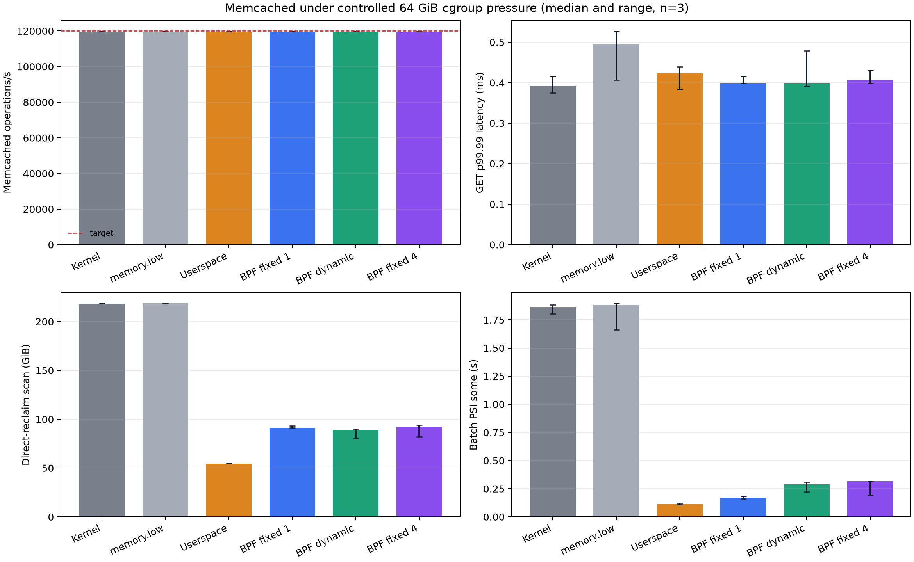
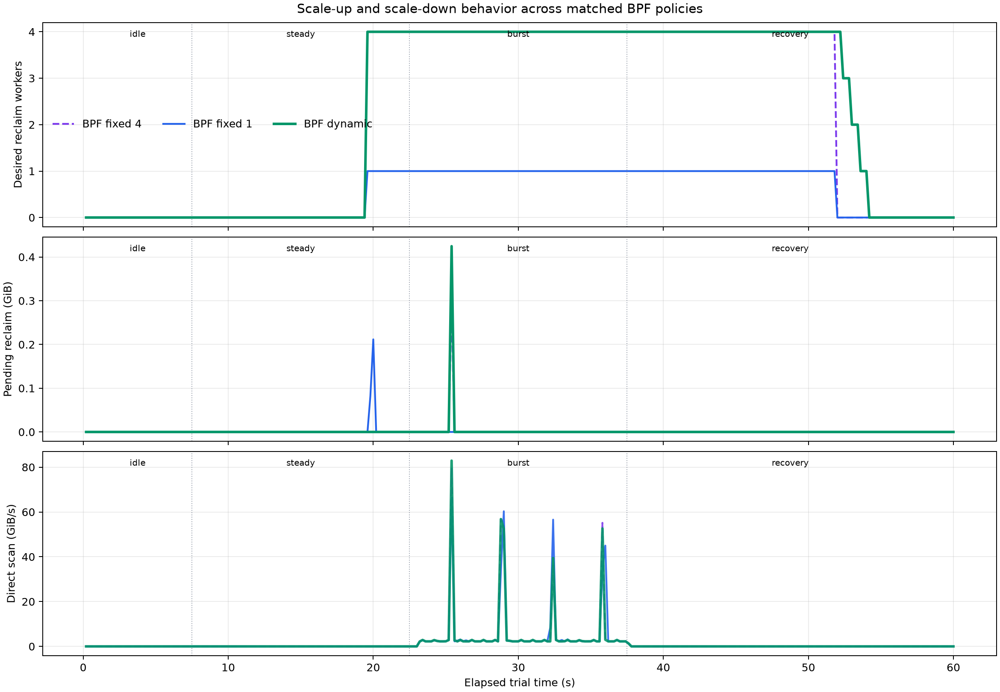
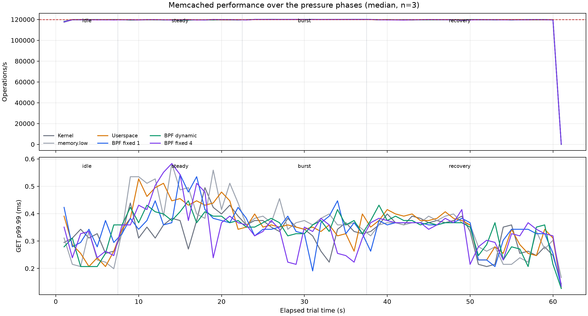

# Dynamic memcg reclaim with Memcached at a 64 GiB limit

## Technical summary

The experiment finds a strong benefit from **proactive targeted reclaim**, but it does not
find a worthwhile benefit from scaling the BPF reclaim pool from one to four workers for
this workload.

- Compared with kernel reclaim, dynamic BPF reclaim reduced median `memory.high` events by
  69.7%, direct-reclaim scanning by 59.3%, batch PSI `some` time by 83.9%, and batch-cgroup
  CPU time by 16.2% in matched trials.
- Memcached held the 120,000 operations/s open-loop target in every policy. Median GET p99
  remained 0.175 ms; median p99.99 was 0.391 ms for the kernel and 0.399 ms for dynamic BPF.
  The reclaim improvement therefore preserved service performance but did not improve it at
  this offered load.
- Dynamic BPF versus BPF fixed-one reduced direct scanning by only 3.27% at the median. It
  increased batch PSI by 61.3%, batch CPU by 3.1%, and desired reclaim-worker slot-seconds by
  316%. Throughput changed by 0.011% and p99.99 did not change at the median.
- Dynamic BPF behaved like fixed-four through nearly the entire pressure interval. Its short
  4 -> 3 -> 2 -> 1 recovery staircase did not save worker capacity relative to fixed-four;
  it used 134.8 versus 129.6 desired-worker slot-seconds.
- The userspace `memory.reclaim` controller was the strongest on direct scanning (75.1% less)
  and batch PSI (93.9% less). Its reclaim-caller CPU is outside the batch cgroup, so its
  batch-CPU number is not directly comparable with the BPF modes.
- `memory.low` alone did not help this hierarchy: its direct scanning and `memory.high`
  events were effectively identical to the kernel baseline.

The supported claim is therefore: **BPF-driven proactive reclaim provides substantial value,
but the current pending/capacity-based concurrency scaler does not provide incremental value
on this Memcached-plus-clean-cache workload.**



## Final policy results

Values are medians across three repetitions. Bracketed values are the full observed range.

| Policy | Operations/s | GET p99.99 (ms) | `memory.high` events | Direct scan (GiB) | Batch PSI some (s) | Batch CPU (s) |
|---|---:|---:|---:|---:|---:|---:|
| Kernel | 119,731 [119,647-119,818] | 0.391 [0.375-0.415] | 58,189 [58,050-58,492] | 218.63 [218.61-218.65] | 1.861 [1.803-1.884] | 157.0 [153.0-160.8] |
| `memory.low` | 119,725 [119,688-119,757] | 0.495 [0.407-0.527] | 58,330 [58,116-58,513] | 218.64 [218.62-218.65] | 1.883 [1.662-1.896] | 154.8 [149.1-158.1] |
| Userspace | 119,740 [119,732-119,854] | 0.423 [0.383-0.439] | 17,621 [17,617-17,633] | 54.36 [54.31-54.74] | 0.110 [0.108-0.123] | 127.2 [121.0-127.6] |
| BPF fixed-one | 119,743 [119,711-119,778] | 0.399 [0.399-0.415] | 17,651 [17,648-17,675] | 91.47 [91.17-93.14] | 0.172 [0.160-0.180] | 125.5 [123.3-133.4] |
| BPF dynamic | 119,726 [119,724-119,760] | 0.399 [0.391-0.479] | 17,603 [17,584-17,622] | 89.03 [80.18-90.09] | 0.290 [0.225-0.309] | 134.7 [127.1-135.5] |
| BPF fixed-four | 119,738 [119,726-119,743] | 0.407 [0.399-0.431] | 17,620 [17,615-17,629] | 92.09 [82.21-93.98] | 0.316 [0.193-0.317] | 132.3 [124.8-133.5] |

All policies had a median GET p99 of 0.175 ms except fixed-four, whose median was 0.167 ms.
Every trial had zero Memcached misses and zero connection errors.

The BPF kthreads run in the batch cgroup, so their CPU is included in BPF batch CPU. The
userspace controller threads remain in the benchmark's cgroup; CPU spent by their synchronous
`memory.reclaim` calls is not included in userspace batch CPU. CPU comparisons among kernel and
BPF modes are meaningful, but the userspace CPU reduction in the table is not an end-to-end CPU
reduction.

### Matched comparisons

Percentage reductions are calculated within each repetition before taking the median. A
negative reduction is a regression.

| Candidate versus baseline | Throughput change | High-event reduction | Direct-scan reduction | Batch-PSI reduction | Batch-CPU reduction | p99.99 reduction |
|---|---:|---:|---:|---:|---:|---:|
| Userspace vs kernel | +0.078% | 69.72% | 75.14% | 93.88% | 20.91% | -12.28% |
| BPF fixed-one vs kernel | +0.010% | 69.62% | 58.17% | 90.74% | 17.95% | -2.05% |
| BPF dynamic vs kernel | +0.024% | 69.72% | 59.28% | 83.92% | 16.21% | -6.40% |
| BPF dynamic vs fixed-one | +0.011% | 0.30% | 3.27% | -61.25% | -3.11% | 0.00% |
| BPF dynamic vs fixed-four | -0.002% | 0.07% | 4.13% | 2.17% | -1.84% | 1.97% |

For dynamic versus fixed-four, the paired direct-scan reduction ranged from -8.30% to 12.93%,
and the PSI reduction ranged from -16.21% to 8.60%. Three repetitions do not support a claim
that either policy is better on those metrics.

## Scale-up and scale-down behavior

The policies authorized closely matched reclaim volume: fixed-one authorized 74.89 GiB,
dynamic authorized 74.82 GiB, and fixed-four authorized 74.83 GiB at the median. BPF reclaim
returned about 75.5-75.6 GiB for each policy. The comparison is therefore primarily about how
the same work is scheduled, not about allowing dynamic BPF to reclaim more memory.



The controller remained at zero workers through idle and most of steady state. When the
parent crossed the control threshold at about 19.6 seconds:

- fixed-one selected one worker;
- fixed-four selected four workers;
- dynamic immediately selected four workers because pending work exceeded its measured
  per-worker capacity;
- dynamic stayed at four through burst and most of recovery, then took three 600 ms
  hysteresis steps to reach zero;
- fixed-four went directly to zero when pending work drained.

Dynamic used 134.8 desired-worker slot-seconds, fixed-four used 129.6, and fixed-one used 32.4.
The extra concurrency did consistently reduce direct scanning versus fixed-one by 2.67-12.05%
per repetition, but the median saving was small and came with worse PSI and CPU. Fixed-four
showed the same pattern, which points to limited marginal scaling in memcg reclaim rather than
a failure to wake the BPF kthreads.

The pending-work graph is a 200 ms point sample. Workers can drain a queue between samples, so
it is useful for timing but not a reliable measure of the true peak queue depth.

## Memcached performance



The service ran at a fixed open-loop target rather than maximum throughput. This makes latency
comparable across reclaim policies and prevents a policy from appearing faster merely because
it completed fewer requests. All six policies delivered 99.7-99.9% of the 120,000 operations/s
target. No phase shows a sustained throughput collapse or a latency step associated with the
burst.

The experiment therefore demonstrates that proactive reclaim improves sibling progress and
reduces reclaim work **without hurting Memcached**. It does not demonstrate a Memcached latency
benefit at this load. A separate offered-load sweep near service saturation is required before
claiming a tail-latency improvement.

## Experimental design

The workload design borrows the Memcached request mix used by
[Hermit](https://www.usenix.org/conference/nsdi23/presentation/qiao): a Facebook-like 99.8%
GET / 0.2% SET mix and Zipf 0.99 key distribution. Hermit is an important positive reference
because its adaptive reclaimer normally used at most two cores, scaled to four during bursts,
and beat fixed reclaim-core counts. This experiment deliberately adds fixed-one and fixed-four
controls to test whether the same scaling claim holds for the branch's memcg helper.

The memory scale also follows public systems-memory examples rather than the original 1 GiB
selftest. [Hermes](https://arxiv.org/abs/2109.02922) evaluates proactive reclamation on services
with tens of GiB of memory, while the
[TierScape artifact](https://github.com/IntelLabs/tierscape) includes a 40 GiB Memcached setup.
[TMO](https://www.cs.cmu.edu/~dskarlat/publications/tmo_asplos22.pdf) and
[DAMON_RECLAIM](https://www.kernel.org/doc/html/v5.17/admin-guide/mm/damon/reclaim.html) provide
additional examples of proactive, feedback-controlled memory reclamation.

### System and software

- Host: dual-socket AMD EPYC 7773X, 256 logical CPUs, 251 GiB RAM.
- Guest: QEMU/virtme-ng, 48 vCPUs, 96 GiB configured RAM, one virtual NUMA node.
- Kernel: `7.2.0-rc6-00638-g02201107f4d6-dirty`, commit `02201107f4d6`, built with clang/LLD
  23; `CONFIG_MEMCG=y`, `CONFIG_PSI=y`, and MGLRU disabled.
- Branch: `codex/bpf-waitq-memcached-eval`, based on
  `origin/bpf-waitq-kthread-reclaim-v1`.
- Memcached: 1.6.40, 12 worker threads, binary protocol.
- Load generator: [memtier_benchmark](https://github.com/redis/memtier_benchmark) 2.5.1 at
  commit `5f634d171b83efca9640c5a87606c47b34d3d330`, 16 threads and one connection per thread.

### Memory hierarchy and data

- Parent `memory.max`: 64 GiB.
- Parent `memory.high`: 44.8 GiB.
- Controller parent target: 41.6 GiB.
- Memcached item-cache limit: 25.6 GiB.
- Prefill: 20,132,659 keys with 1 KiB values, 19.2 GiB of payload; observed service-cgroup
  memory was about 22.4 GiB.
- `memory.low` policy: service protection of 28.8 GiB.
- Batch source: an 80 GiB preallocated, unwritten ext4 file, scanned by 16 threads with
  disjoint ranges.

The unwritten ext4 extents produce clean page-cache pressure without storage reads. Each trial
faulted about 129 GiB by wrapping over the 80 GiB file. This removes device latency and isolates
reclaim scheduling, but it is not a model of remote-memory, swap, or SSD I/O.

### Trial phases and policies

Each trial used a fresh Memcached process and a fresh prefill, then ran for 60 seconds:

| Phase | Duration | Batch fault rate |
|---|---:|---:|
| Idle | 7.5 s | 0 GiB/s |
| Steady | 15 s | 1.6 GiB/s |
| Burst | 15 s | 6.4 GiB/s |
| Recovery | 22.5 s | 0.8 GiB/s for the first half, then idle |

The six policies were kernel reclaim, service `memory.low`, a four-thread userspace
`memory.reclaim` controller, BPF fixed-one, BPF dynamic 1-4, and BPF fixed-four. The proactive
policies used the same 200 ms control epoch, 16 MiB reclaim quantum, parent target, refault
budget, and authorization formula. Trial order was cyclically rotated for each of three
repetitions.

## Measurement and data quality

The result uses median and full range because three repetitions are enough to reject the large
scaling effect hypothesized here, but not enough for a precise confidence interval. The paired
tables compare policies within the same repetition.

The automated quality gate passed:

- 18 of 18 trials completed and each supplied exactly 300 200 ms samples;
- 18 prefill and 18 measurement Memtier JSON files parsed successfully;
- every trial stayed within 1% of the offered-load target;
- zero cache misses, connection errors, `memory.max` events, OOM events, or OOM kills;
- batch fault volume differed by less than 0.01 GiB;
- zero failed BPF reclaim pages and valid controller debt accounting;
- all adaptive trials scaled above one worker and returned to zero;
- no kernel crash, lockup, hung-task, or sanitizer signature in dmesg.

The VM boot log has a QEMU CPU-feature dependency notice and an ACPI `_OSC` message. Neither
appeared during the workload or correlated with a trial failure.

See [QA.md](QA.md), [trial_metrics.csv](trial_metrics.csv),
[policy_summary.csv](policy_summary.csv), [paired_comparisons.csv](paired_comparisons.csv), and
the executed [analysis.ipynb](analysis.ipynb) for the auditable calculations.

## Interpretation

### Why proactive reclaim helped

The controller starts reclaiming the batch cgroup before the shared parent forces faulting
threads into direct reclaim. That moves reclaim work away from the allocation path. The effect
is visible in lower `memory.high` events, less direct scanning, less batch PSI, and less batch
CPU. Targeting the batch cgroup also avoids reclaiming Memcached's anonymous item cache.

`memory.low` protects the service cgroup, but it does not create free memory or proactively
reclaim the batch cgroup. In this setup Memcached was already below its protected allowance;
the parent still crossed `memory.high`, so batch faulting threads performed essentially the
same direct reclaim as the unprotected kernel baseline.

### Why dynamic concurrency did not add value

The dynamic controller estimates capacity from pages requested per epoch. Pending work exceeded
that estimate as soon as control activated, so it jumped directly to four and remained there.
The fixed controls show weak marginal scaling from additional BPF workers: direct scanning fell
slightly, but PSI and CPU got worse. Plausible causes include shared memcg/LRU serialization,
repeated scans of the same reclaimable population, and synchronization overhead around a single
target memcg. The present data identifies the scalability symptom but does not isolate which
kernel lock or scan path dominates.

The userspace controller writes synchronously to `memory.reclaim`, while the BPF workers call
`bpf_try_to_free_mem_cgroup_pages()` directly. Their similar authorization volume but different
direct-scanning outcome suggests that API completion semantics, retry behavior, or timing also
deserve investigation. The userspace reclaim caller is also accounted outside the batch cgroup,
so a future comparison needs whole-guest CPU accounting. These are inferences from the results,
not proven root causes.

### Memcached-specific policy gap

The controller's service feedback is `workingset_refault_file`. Memcached's item cache is
anonymous memory, so this signal stayed at zero. The experiment primarily exercised parent
error feedback, not workload-hotness feedback. A production Memcached policy should incorporate
anonymous refault/activity, PSI, or a service SLO signal rather than relying on file refaults.

## Recommendations and next experiments

1. Use proactive targeted reclaim, but default this workload to one BPF worker. Scale out only
   when measured reclaimed pages per unit CPU increase with concurrency.
2. Change the capacity estimator from requested pages to actual reclaimed pages and track
   per-worker reclaim latency, scan efficiency, and CPU. Stop scaling when marginal efficiency
   falls.
3. Add fixed-two and a concurrency sweep. The current 1-versus-4 controls bound the result but
   do not locate the best point.
4. Compare `memory.reclaim` and the BPF helper with the same single worker and trace
   `try_to_free_mem_cgroup_pages()` retries, LRU locks, scan/steal ratio, and reclaim duration.
5. Run a Memcached offered-load sweep at roughly 60%, 80%, 90%, and 95% of measured capacity to
   determine whether reduced reclaim work turns into a service tail-latency benefit near
   saturation.
6. Add an anonymous-memory pressure workload and a real cold-storage tier. This clean-cache test
   intentionally excludes swap/SSD/remote-memory I/O and hot/cold classification.
7. Repeat with NUMA pinning and MGLRU enabled. The current guest has one virtual NUMA node and
   does not evaluate topology-sensitive reclaim or modern LRU generation behavior.

## Reproduction

The exact benchmark configuration is in [config.json](config.json), and guest provenance is in
[environment.txt](environment.txt). The run used:

```sh
BPF_MEMCG_VM_CPUS=48 \
BPF_MEMCG_VM_MEMORY=96G \
BPF_MEMCG_VM_DISK_IMAGE=.kdev/bench-work/memcg-reclaim-96g.img \
BPF_MEMCG_VM_BATCH_FILE=batch.dat \
tools/testing/selftests/bpf/run_bench_memcg_reclaim_vm.sh \
  --workload memcached \
  --modes kernel,memory-low,userspace,bpf-fixed-1,bpf,bpf-fixed-max \
  --repeat 3 \
  --duration-scale 3.75 \
  --parent-max 64G \
  --batch-threads 16 \
  --memcached-value 1024 \
  --memcached-threads 12 \
  --memtier-threads 16 \
  --memtier-clients 1 \
  --memtier-rate 120000 \
  --memtier-bin "$PWD/.kdev/tools/memtier-benchmark-2.5.1/memtier_benchmark" \
  --output "$PWD/tools/testing/selftests/bpf/results/memcg-reclaim-memcached-64g-20260821" \
  --seed 20260821 \
  --verbose
```

The disk image contained a preallocated 80 GiB `batch.dat`. The checked-in analyzer can be run
with:

```sh
python3 tools/testing/selftests/bpf/analyze_memcg_reclaim_memcached.py \
  tools/testing/selftests/bpf/results/memcg-reclaim-memcached-64g-20260821
```
